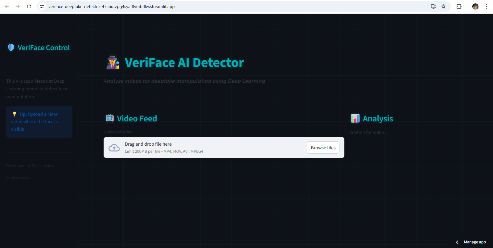
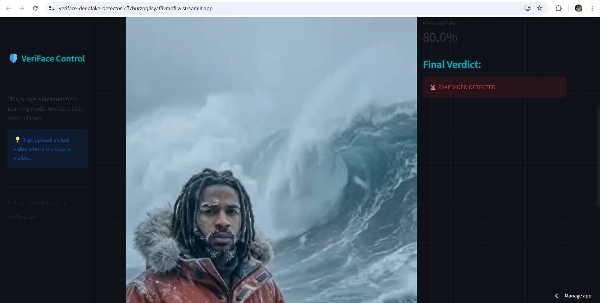

# 🛡️ VeriFace: Deepfake Detection System


> **VeriFace** is an AI-powered tool designed to detect deepfake videos by analyzing facial artifacts using Deep Learning (MesoNet architecture).

---

## 🚀 Live Demo
Check out the live application running on the cloud:
**[👉 Click Here to Launch VeriFace](https://veriface-deepfake-detector-47cburzpg4syaf8vmbfllw.streamlit.app/)**

---

## 🧐 Problem Statement
With the rise of Generative AI, creating hyper-realistic fake videos ("Deepfakes") has become dangerously easy. These videos can be used for misinformation, identity theft, and fraud. **VeriFace** aims to provide a simple, accessible tool for the public to verify video authenticity.

## 🛠️ Tech Stack
* **Language:** Python
* **Frontend:** Streamlit (Custom CSS for UI)
* **Deep Learning:** TensorFlow / Keras
* **Face Detection:** MTCNN (Multi-task Cascaded Convolutional Networks)
* **Computer Vision:** OpenCV
* **Architecture:** MesoNet (specialized for detecting facial manipulation)

---

## 📸 Screenshots
*(Optional: Upload your screenshots to an 'assets' folder and link them here)*

### 🖥️ Professional Dashboard


### 🕵️‍♂️ Detection in Action


---

## ⚙️ How It Works
1.  **Input:** User uploads an `.mp4` video file.
2.  **Preprocessing:** The system scans the video and extracts frames.
3.  **Face Detection:** **MTCNN** identifies and crops faces from the frames.
4.  **Analysis:** The cropped faces are fed into the **MesoNet** neural network.
5.  **Output:** The model assigns a probability score (Real vs. Fake) and displays the verdict.

---

## 💻 Installation (Run Locally)
If you want to run this project on your own machine:

1.  **Clone the Repository**
    ```bash
    git clone [https://github.com/BhaskarNova/VeriFace-Deepfake-Detector.git](https://github.com/BhaskarNova/VeriFace-Deepfake-Detector.git)
    cd VeriFace-Deepfake-Detector
    ```

2.  **Install Dependencies**
    ```bash
    pip install -r requirements.txt
    ```

3.  **Run the App**
    ```bash
    streamlit run app.py
    ```

---

## 👨‍💻 Developer
**BhaskarNova** *B.Tech Information Technology | AI Enthusiast*

---